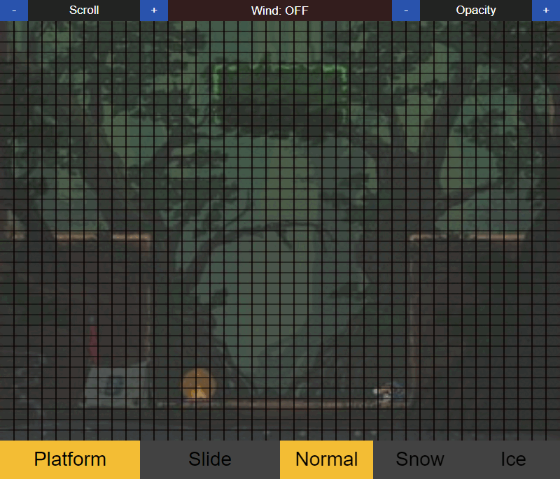

  

# Rice King - Level Creator

Level Creator for ***Rice King*** I made using JavaScript and canvas.  
Basically I needed a tool for easier game terrain creation.

 

>*I would also want to say thank you to my friend and mentor <a href="https://github.com/Ph0enixKM">***Ph0enix***</a> who believed in me and was my guide for the whole time.*  

 
<a href="https://github.com/xPiccolinox/RiceKing">

> `Also worth check out:`
>
> 

</a>
 

# Features

> # Canvas 
> 
> ## Multiple platform choices
>
>   
> 
> ## Wind
>
>   
> 
> ## Map scrolling
>
>   
> 
> ## Background Opacity
>
> 
 

>
> # Platforms Menu
> 
> - ## Add Platform - add selected platform from canvas
>
> - ## Copy - copy all the platforms to clipboard
>
> - ## Level input and Apply Level - input level and apply it to all the platforms
>
> - ## X - Delete selected platform
>
>   
 

>
> # Paste platforms
> 
> ## Paste string with all the platforms and import them to Platforms Menu
>
>   

  
***Hope you'll enjoy it, have fun B)***